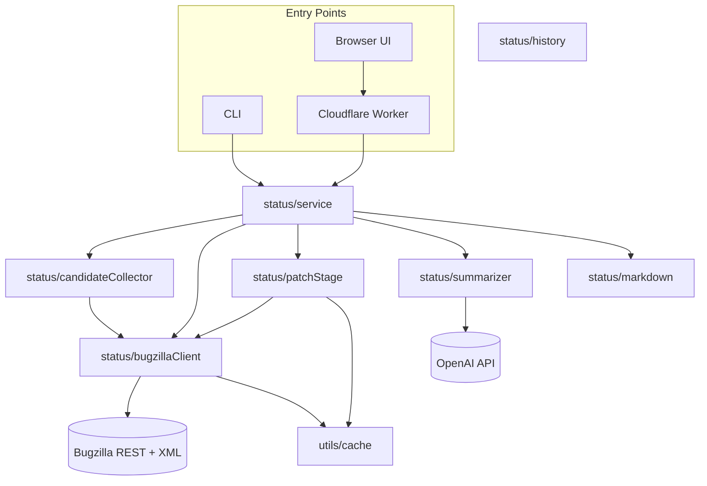

# SnazzyBot Architecture

## Architecture

There is a dedicated `status/` package that splits the pipeline
into composable services. Shared utilities (caching, error helpers, time
helpers) live under `src/utils`, and `core.ts` now exports the public API.

Highlights:

- **BugzillaClient** centralises REST/XML access and caching policy.
- **CandidateCollector** & **history** modules isolate discovery and
  qualification rules so API/CLI share identical logic.
- **PatchStage** wraps `loadPatchContext` with batching and hooks integration.
- **Summarizer** encapsulates OpenAI prompts, keeping the main service pure.
- Shared caching and error helpers remove duplicated patterns across modules.

The `core.ts` entry point exports the service API, keeping the external
surface stable while enabling future expansion inside the `status/` package.
